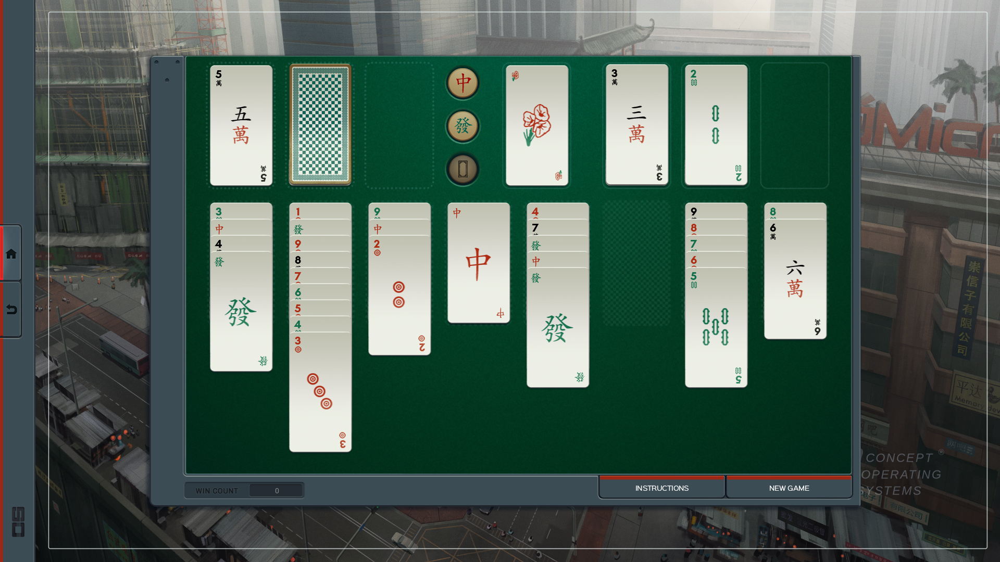

# shenzhen

Solves games of Shenzhen Solitaire,
a minigame [available standalone](http://store.steampowered.com/app/570490/SHENZHEN_SOLITAIRE/)
or as part of [Shenzhen I/O](http://www.zachtronics.com/shenzhen-io/)
from [Zachtronics](http://www.zachtronics.com/).
Here's an [video intro to the gameplay](https://www.youtube.com/watch?v=kT7bEJQsVYk), but if you know FreeCell it's basically that with three suits and "dragon" cards that block gameplay.
And this [glossary of Solitaire terms](https://functor.tokyo/blog/2017-07-28-ghc-warnings-you-should-enable) may be useful.

Written for practice with Haskell and HaskellStack.

## TODO

  - [x] create Stack project
  - [x] types for cards
  - [x] create standard deck
  - [x] Layout type
  - [x] custom Show instances for Card, Layout
  - [ ] enter game Layout
  - [x] shuffle deck to create Layout
  - [ ] Game type
  - [x] Use [standard terms](https://en.wikipedia.org/wiki/Glossary_of_patience_terms)
  - [x] Move type for card moves, collecting dragons
  - [x] `move :: Game -> Move -> Game`
    - [x] `move` with `MoveFromColumnToCell`
    - [x] `move` with `MoveFromCellToColumn`
    - [x] `move` with `BuildFromColumn`
    - [x] `move` with `BuildFromCell`
    - [x] `move` with `Pack`
    - [x] `move` with `CollectDragons`
  - [x] replicate automatic build of released `Card`s
  - [x] automatically build `Flower`
  - [x] automatically build after player `Move` applied
  - [x] automatically build at game start and between moves
  - [x] Detect game win
  - [x] Detect game loss
  - [x] Generate list of possible Moves for a position
  - [x] Filter possible Moves against Game history to avoid loops
  - [ ] Take moves until game win/loss
  - [ ] QuickCheck that the number + distribution of cards in the game is constant

## Cleanups and open questions:

  - [ ] Organize code into modules, don't export constructors or the many unsafe utility functions for `Move`s
  - [ ] Silence `-Wincomplete-patterns` and `-Wincomplete-uni-patterns` on util funcitons
  - [ ] Encode that `Tableau` has exactly one `Foundation` per `Suit`
  - [ ] Encode that `Tableau` has exactly one `DragonCell` per `Suit`
  - [ ] Encode that `FlowerCell` can only hold a `Flower`
  - [ ] Look at `Bound` or `Enum` for `Rank`
  - [ ] `mayTakeTo` and `mkRunTo` want some kind of help
  - [x] The `Move` constructors must enforce validity to avoid passing around broken `Move` data, but then `move` has none. Does this make `move` clear or unsafe? What if this was more mature with `Move` in its own module not exporting the default constructor?
  - [x] This ties into `mayTakeTo` and `unsafeTakeTo`. `mkMove` must use the former but `move` really wants unsafe to avoid unwrapping `Maybe`. I can't even see how to unwrap it, really.
  - [ ] There must be some higher-level way to express `lastCardsOfPossibleRuns`
  - [ ] And `novelPossibleMoves`, which is almost just `move now (possibleMoves now) \\ previous game where now = current game`
  - [ ] Require cells be used left-to-right to cut down state space of possible moves.
  - [ ] DragonCell could model explicitly that it's `Card | CollectedDragons | Nothing`
  - [ ] Is `lost` correct? It might be only correct in the context of a depth-first search, where a `previous` `Tableau` would've already been searched for a win.
  - [ ] Can I enforce that a `Game` only includes `Move` that apply to prior `Tableau`?
  - [ ] Can I ensure `move` is only given `Move`s generated from the `Tableau` they're being applied to?
  - [ ] Rename `Move` `playerMove` or something and don't export it, just `step` as `move`.
